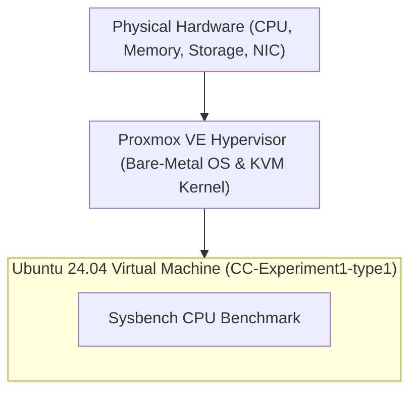
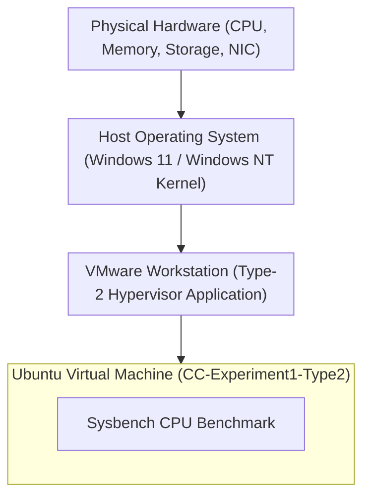

# Performance Analysis of Type-1 and Type-2 Hypervisors

[](#)
[](#)
[](#)
[](#)

---

## Executive Summary

This repository contains the complete experimental setup, empirical benchmark data, performance visualization, and technical report comparing the CPU performance of a **Type-1 Bare-Metal Hypervisor (Proxmox VE)** and a **Type-2 Hosted Hypervisor (VMware Workstation)**.

Both hypervisors were deployed with identically configured **Ubuntu Virtual Machines** (2 vCPU, 2 GB RAM, 20 GB Disk). The standard `sysbench` CPU prime-number calculation benchmark (`--cpu-max-prime=20000`) was executed on both virtual machines under identical workload conditions.

### Key Finding

> **Proxmox VE (Type-1 Hypervisor) achieved 1,716.69 Events/sec compared to VMware Workstation's 1,364.78 Events/sec — demonstrating a +25.79% throughput advantage and a 20.55% reduction in average latency.**

---

## Table of Contents

1. [Project Objectives](#1-project-objectives)
2. [Hypervisor Architectural Comparison](#2-hypervisor-architectural-comparison)
3. [Virtual Machine Specifications](#3-virtual-machine-specifications)
4. [Experimental Procedure](#4-experimental-procedure)
5. [Empirical Results & Screenshots](#5-empirical-results--screenshots)
6. [Performance Comparison Table](#6-performance-comparison-table)
7. [Metric Explanations & Visualizations](#7-metric-explanations--visualizations)
8. [Technical Analysis & Discussion](#8-technical-analysis--discussion)
9. [Conclusion & Engineering Takeaways](#9-conclusion--engineering-takeaways)
10. [Repository Structure & Reproduction](#10-repository-structure--reproduction)

---

## 1. Project Objectives

The primary objectives of this Cloud Computing laboratory experiment are:

1. **Deployment**: Provision two identical Ubuntu Virtual Machines across different hypervisor architectures:
   - **Type-1 (Bare-Metal)**: Proxmox VE (Kernel-based Virtual Machine / KVM)
   - **Type-2 (Hosted)**: VMware Workstation Pro on a Windows Host OS
2. **Standardization**: Enforce uniform hardware resource allocations (2 vCPU, 2048 MB RAM, 20 GB Virtual Storage) to ensure direct comparability.
3. **Benchmarking**: Execute the `sysbench` CPU computational benchmark using 20,000 prime numbers to stress test CPU virtualization efficiency.
4. **Metric Collection**: Capture execution time, total events processed, throughput (events/sec), and latency statistics (min, avg, max, 95th percentile).
5. **Architectural Evaluation**: Quantify the performance overhead introduced by host operating system abstraction layers in Type-2 hypervisors versus bare-metal hypervisor execution.

---

## 2. Hypervisor Architectural Comparison

### Type-1 Hypervisor — Proxmox VE (Bare-Metal Architecture)

Proxmox VE runs directly on the bare-metal physical host hardware. The Linux kernel integrated with KVM (Kernel-based Virtual Machine) acts as the hypervisor. Guest operating system instructions execute directly on hardware CPU VT-x/AMD-V extensions without passing through an intermediate desktop operating system.



```
+-------------------------------------------------------------------+
|               Ubuntu Virtual Machine (Type-1 Guest)               |
+-------------------------------------------------------------------+
|               Proxmox VE Hypervisor (Linux Kernel / KVM)          |
+-------------------------------------------------------------------+
|                 Physical Server Hardware (Bare Metal)             |
+-------------------------------------------------------------------+
```

---

### Type-2 Hypervisor — VMware Workstation (Hosted Architecture)

VMware Workstation runs as an application process on top of a host operating system (Windows 11/10). CPU requests from the guest VM must navigate through the VMware VMM engine, translate through host OS system calls, and be scheduled by the Windows NT kernel scheduler before reaching physical hardware.



```
+-------------------------------------------------------------------+
|               Ubuntu Virtual Machine (Type-2 Guest)               |
+-------------------------------------------------------------------+
|               VMware Workstation (Virtual Machine Monitor)        |
+-------------------------------------------------------------------+
|               Host Operating System (Windows 11 / 10)             |
+-------------------------------------------------------------------+
|                        Physical PC Hardware                       |
+-------------------------------------------------------------------+
```

---

## 3. Virtual Machine Specifications

To guarantee scientific accuracy and eliminate resource skewing, identical configurations were assigned to both VMs:

| Resource Parameter | Proxmox VE (Type-1) | VMware Workstation (Type-2) | Status |
| :--- | :--- | :--- | :--- |
| **Virtual Machine Name** | `CC-Experiment1-type1` | `CC-Experiment1-Type2` | Standardized |
| **VM Identifier** | `VMID 123` | `janzz-virtual-machine` | Standardized |
| **Guest Operating System** | Ubuntu 24.04.3 LTS AMD64 | Ubuntu Linux 64-bit | Standardized |
| **CPU Allocation** | 2 vCPU (1 Socket, 2 Cores) | 2 vCPU (1 Processor, 2 Cores) | Identical |
| **CPU Type / Model** | `x86-64-v2-AES` | Host Passthrough / Default | Hardware Matched |
| **RAM Allocation** | 2048 MiB (2.0 GB) | 2048 MB (2.0 GB) | Identical |
| **Virtual Disk Capacity** | 20.0 GB | 20.0 GB | Identical |
| **Virtual Network Adapter**| VirtIO (`vmbr0`) | NAT (`VMnet8`) | Standardized |
| **Benchmark Tool** | `sysbench 1.0.20` | `sysbench 1.0.20` | Identical |

---

## 4. Experimental Procedure

**PREREQUISITES**

_Type-1 vs Type-2 Hypervisor Performance Analysis Experiment_

Before performing the experiment, ensure that the following requirements are available and configured.

**1\. Hardware and Software Requirements**

| **Component**              | **Requirement**                 |
| -------------------------- | ------------------------------- |
| Type-1 Hypervisor          | Proxmox VE                      |
| Type-2 Hypervisor          | VMware Workstation              |
| Guest Operating System     | Ubuntu 22.04 or later           |
| Web Browser                | Google Chrome / Mozilla Firefox |
| Performance Testing Tool   | Sysbench                        |
| Version Control System     | Git                             |
| Remote Repository Platform | GitHub Account                  |

**2\. Proxmox VE Access Requirements**

Ensure that the following information is available before accessing the Type-1 hypervisor environment.

| **Requirement**              | **Details**                             |
| ---------------------------- | --------------------------------------- |
| Proxmox VE Server IP Address | Provided by the laboratory              |
| Port Number                  | 8006                                    |
| Username                     | Assigned login credentials              |
| Password                     | Assigned login credentials              |
| Network Access               | Access to the Proxmox VE server network |

The Proxmox VE server can be accessed using:

```
https://<PROXMOX_SERVER_IP>:8006
```

**3\. VMware Workstation Requirements**

Ensure that VMware Workstation is installed on the local system before beginning the Type-2 hypervisor analysis.

The following resources must be available:

- VMware Workstation
- Ubuntu ISO image
- Minimum 20 GB free disk space
- Minimum 4 GB available RAM
- Internet connectivity for installing Sysbench
- Git installed on the system

**4\. Standard Virtual Machine Configuration**

To ensure a fair performance comparison, the same virtual machine configuration must be used for both Type-1 and Type-2 hypervisors.

| **Resource**           | **Configuration**                      |
| ---------------------- | -------------------------------------- |
| Guest Operating System | Ubuntu                                 |
| CPU                    | 2 vCPU                                 |
| Memory                 | 2 GB RAM                               |
| Disk                   | 20 GB                                  |
| Benchmark Tool         | Sysbench                               |
| CPU Benchmark Command  | sysbench cpu --cpu-max-prime=20000 run |

**Important:** Both Proxmox VE and VMware Workstation virtual machines must use identical resource configurations for performance comparison.

**5\. Screenshots Required for GitHub Submission**

Screenshots must be captured during the experiment and uploaded to the GitHub repository as implementation evidence. The following screenshots are mandatory.

**5.1 Type-1 Hypervisor – Proxmox VE Screenshots**

**Screenshot 1: Proxmox VE Dashboard**

**Where to capture:**

After successfully logging in to the Proxmox VE web interface.

**Navigation:**

_Browser -> https://&lt;PROXMOX_SERVER_IP&gt;:8006 -> Login -> Proxmox VE Dashboard_

**File Name:** 01-proxmox-dashboard.png

**Screenshot 2: Virtual Machine Configuration**

**Where to capture:**

During the virtual machine creation process, after configuring the VM resources. Capture the screen showing:

- VM Name
- Operating System
- CPU configuration
- Memory configuration
- Disk configuration

**Navigation:**

_Proxmox VE -> Select Proxmox Node -> Create VM -> General / CPU / Memory / Confirm_

The screenshot may be taken from the Confirm page because it displays the final VM configuration.

**File Name:** 02-proxmox-vm-configuration.png

**Screenshot 3: Virtual Machine Running**

**Where to capture:**

After creating and starting the virtual machine.

**Navigation:**

_Datacenter -> Proxmox Node -> Select Created VM -> Start_

Capture the VM status showing Running.

**File Name:** 03-proxmox-vm-running.png

**Screenshot 4: Ubuntu Running in Proxmox Console**

**Where to capture:**

After successfully installing Ubuntu inside the Proxmox virtual machine.

**Navigation:**

_Datacenter -> Proxmox Node -> Virtual Machine -> Console_

Capture the Ubuntu desktop or terminal running inside the Proxmox console.

**File Name:** 04-proxmox-ubuntu-console.png

**Screenshot 5: CPU and Memory Configuration**

**Where to capture:**

Inside the Ubuntu virtual machine terminal. Execute:

```
lscpu
```

Then execute:

```
free -h
```

Capture the terminal output.

**File Name:** 05-proxmox-system-configuration.png

**Screenshot 6: Sysbench Performance Result**

**Where to capture:**

Inside the Ubuntu virtual machine terminal after executing the benchmark. Execute:

```
sysbench cpu --cpu-max-prime=20000 run
```

Capture the complete benchmark output. Ensure the following values are visible:

- Total execution time
- Total number of events
- Events per second
- Latency

**File Name:** 06-proxmox-sysbench-result.png

**Screenshot 7: Proxmox Resource Monitoring**

**Where to capture:**

From the Proxmox VE virtual machine monitoring page.

**Navigation:**

_Datacenter -> Proxmox Node -> Virtual Machine -> Summary_

Capture the resource usage graphs showing:

- CPU Usage
- Memory Usage
- Network Usage
- Disk Usage

**File Name:** 07-proxmox-resource-monitoring.png

**5.2 Type-2 Hypervisor – VMware Workstation Screenshots**

**Screenshot 8: VMware Virtual Machine Configuration**

**Where to capture:**

During the virtual machine creation process or from the VM hardware settings page. The screenshot must show:

- Processor configuration
- Memory configuration
- Disk configuration

**Navigation:**

_VMware Workstation -> Create a New Virtual Machine -> Customize Hardware_

_OR_

_VM -> Settings_

**File Name:** 01-vmware-vm-configuration.png

**Screenshot 9: VMware Virtual Machine Running**

**Where to capture:**

After installing Ubuntu and starting the virtual machine. Capture the Ubuntu desktop or terminal running inside VMware Workstation.

**File Name:** 02-vmware-vm-running.png

**Screenshot 10: VMware CPU and Memory Configuration**

**Where to capture:**

Inside the Ubuntu virtual machine terminal. Execute:

```
lscpu
```

Then execute:

```
free -h
```

Capture the terminal output.

**File Name:** 03-vmware-system-configuration.png

**Screenshot 11: VMware Sysbench Performance Result**

**Where to capture:**

Inside the Ubuntu virtual machine terminal after executing:

```
sysbench cpu --cpu-max-prime=20000 run
```

Capture the complete benchmark output.

**File Name:** 04-vmware-sysbench-result.png

**5.3 Performance Comparison Screenshot**

**Screenshot 12: Final Performance Comparison**

Create a comparison table using the benchmark results obtained from both hypervisors. The comparison should include:

| **Parameter**        | **Type-1 Proxmox VE** | **Type-2 VMware Workstation** |
| -------------------- | --------------------- | ----------------------------- |
| Total Execution Time | 9.9943                | 10.003                        |
| Total Events         | 14548                 | 2301959                       |
| Events per Second    | 1453.98               | 230195.9                      |
| Average Latency      | 0.69 ms               | 0.01 ms                       |

Capture the completed comparison table.

**File Name:** 01-hypervisor-performance-comparison.png

**6\. Screenshot Storage Structure**

Store all screenshots using the following directory structure before pushing the experiment to GitHub.

```
```text
CC-Experiment-01-Hypervisor-Analysis/
|
+-- screenshots/
|   |
|   +-- type1-proxmox/
|   |   +-- 01-proxmox-dashboard.png
|   |   +-- 02-proxmox-vm-configuration.png
|   |   +-- 03-proxmox-vm-running.png
|   |   +-- 04-proxmox-ubuntu-console.png
|   |   +-- 05-proxmox-system-configuration.png
|   |   +-- 06-proxmox-sysbench-result.png
|   |   +-- 07-proxmox-resource-monitoring.png
|   |
|   +-- type2-vmware/
|   |   +-- 01-vmware-vm-configuration.png
|   |   +-- 02-vmware-vm-running.png
|   |   +-- 03-vmware-system-configuration.png
|   |   +-- 04-vmware-sysbench-result.png
|   |
|   +-- comparison/
|       +-- 01-hypervisor-performance-comparison.png
|
+-- results/
|   +-- performance-analysis.md
|
+-- README.md
```
```


**PART A: PERFORMANCE ANALYSIS USING TYPE-1 HYPERVISOR – PROXMOX VE**

**1\. Accessing the Proxmox VE Web Interface**

Proxmox VE is deployed on a centralized physical server and can be accessed remotely through its web-based management interface.

**Procedure**

1. Connect the system to the network where the Proxmox VE server is accessible.
2. Open a supported web browser.
3. Enter the following URL in the address bar:

```
https://<PROXMOX_SERVER_IP>:8006
```

**Example:**

```
https://192.168.X.X:8006
```

1. Press Enter.

**Note**

_The Proxmox VE server IP address and login credentials must be provided before beginning the experiment._

**2\. Accessing the Proxmox VE Login Page**

A browser security warning may appear because Proxmox VE uses a self-signed SSL certificate.

**Click Advanced.**

**Select Proceed to &lt;Server IP&gt;.**

_The Proxmox VE login page will be displayed._

**3\. Logging in to Proxmox VE**

Enter the assigned login credentials.

| **Parameter** | **Value**            |
| ------------- | -------------------- |
| Username      | Provided Credentials |
| Password      | Provided Credentials |
| Realm         | As Configured        |

**Click Login.**

_After successful authentication, the Proxmox VE management dashboard will be displayed._

**4\. Understanding the Proxmox VE Interface**

The left-side navigation panel contains the Proxmox VE infrastructure hierarchy.

```
Datacenter
  |
  +-- Proxmox Node
         |
         +-- Virtual Machines
         +-- Storage
         +-- Network
```

The Proxmox VE interface provides access to:

- Datacenter resources
- Proxmox server node
- Virtual machines
- Storage resources
- Network configuration
- CPU and memory utilization

**5\. Creating a Virtual Machine in Proxmox VE**

A virtual machine is created using the Create VM wizard available in the Proxmox VE web interface.

The VM creation process consists of the following stages:

```
General -> OS -> System -> Disks -> CPU -> Memory -> Network -> Confirm
```

**Step 1: Select the Proxmox Node**

From the left-side navigation panel:

1. Expand Datacenter.
2. Select the required Proxmox server node.

**Example:**

```
Datacenter -> pve
```

_The node summary page will be displayed._

**Step 2: Open the Create VM Wizard**

**Click the Create VM button located in the upper-right corner of the Proxmox VE interface.**

_The Create: Virtual Machine configuration wizard will open._

**6\. Configuring General Settings**

The first section of the VM creation wizard is General.

Configure the following parameters:

| **Parameter** | **Configuration**                     |
| ------------- | ------------------------------------- |
| Node          | Selected Proxmox Node                 |
| VM ID         | Automatically Assigned / Allocated ID |
| Name          | Unique Virtual Machine Name           |

**Recommended Naming Convention**

```
<Name>-Type1
```

**Example:**

```
CC-Experiment1-Type1
```

**After completing the configuration, click Next.**

**7\. Configuring the Operating System**

The next section is OS.

**Procedure**

1. Select Use CD/DVD Disc Image File (ISO).
2. Select the storage location containing the ISO image.
3. Select the required Ubuntu ISO image.

**Example:**

```
Storage: local
ISO Image: ubuntu-22.04.iso
```

The configuration should be:

| **Parameter**      | **Configuration** |
| ------------------ | ----------------- |
| Installation Media | ISO Image         |
| Storage            | local             |
| Operating System   | Ubuntu            |

**Click Next.**

**8\. Configuring System Settings**

The System section configures the virtual machine hardware platform.

Use the default settings unless otherwise specified.

| **Parameter**   | **Configuration** |
| --------------- | ----------------- |
| Graphics Card   | Default           |
| Machine         | Default           |
| BIOS            | Default           |
| SCSI Controller | Default           |

**Click Next.**

**9\. Configuring Virtual Disk**

The Disks section is used to configure virtual storage for the VM.

Configure the following parameters:

| **Parameter** | **Configuration**            |
| ------------- | ---------------------------- |
| Storage       | local-lvm / Assigned Storage |
| Disk Size     | 20 GB                        |
| Bus/Device    | Default                      |

**Click Next.**

**10\. Configuring CPU Resources**

The CPU section is used to allocate virtual processor resources.

Configure:

| **Parameter** | **Value** |
| ------------- | --------- |
| Sockets       | 1         |
| Cores         | 2         |

_Therefore: Total vCPU = 2_

**Click Next.**

**11\. Configuring Memory Resources**

The Memory section is used to allocate RAM to the virtual machine.

Configure:

| **Parameter** | **Value** |
| ------------- | --------- |
| Memory        | 2048 MiB  |

_Equivalent memory allocation: 2048 MiB = 2 GB RAM_

**Click Next.**

**12\. Configuring Network**

The Network section configures the virtual network interface.

Configure:

| **Parameter** | **Value**        |
| ------------- | ---------------- |
| Bridge        | vmbr0            |
| Model         | Default / VirtIO |

_The vmbr0 bridge connects the virtual machine to the configured network._

**Click Next.**

**13\. Confirming Virtual Machine Configuration**

The final section is Confirm.

Review the complete configuration.

| **Resource**     | **Configuration**    |
| ---------------- | -------------------- |
| VM Name          | CC-Experiment1-Type1 |
| Operating System | Ubuntu               |
| CPU              | 2 vCPU               |
| Memory           | 2 GB                 |
| Disk             | 20 GB                |
| Network          | vmbr0                |

**Verify the configuration and click Finish.**

_The virtual machine will be created._

**14\. Verifying the Created Virtual Machine**

After successful VM creation:

1. Locate the newly created virtual machine in the left-side navigation panel.
2. Select the virtual machine.

_The VM status and configuration details will be displayed._

**Example hierarchy:**

```
Datacenter
  |
  +-- pve
       |
       +-- local
       +-- local-lvm
       |
       +-- VM-ID (CC-Experiment1-Type1)
```

**15\. Starting the Virtual Machine**

**Select the created virtual machine.**

**Click Start from the top-right corner.**

_The VM status will change from Stopped to Running._

**16\. Opening the Virtual Machine Console**

After starting the VM:

1. Select the virtual machine from the navigation panel.
2. Select Console from the available VM options.

_The virtual machine display will open within the browser._

_The Ubuntu installation interface will be displayed._

**17\. Installing Ubuntu Operating System**

Complete the Ubuntu installation using the following general procedure:

1. Select the required language.
2. Select Install Ubuntu.
3. Configure the keyboard layout.
4. Select the required installation type.
5. Select the virtual disk for installation.
6. Configure the timezone.
7. Create the operating system user account.
8. Complete the installation process.
9. Restart the virtual machine.

_After restarting, log in to the Ubuntu virtual machine._

**18\. Verifying the Virtual Machine**

Open the terminal in the Ubuntu virtual machine and execute:

```
hostnamectl
```

Verify the following information:

- Hostname
- Operating System
- Kernel Version
- Architecture

**19\. Analyzing CPU Configuration**

Execute:

```
lscpu
```

Observe the following parameters:

- Architecture
- CPU(s)
- CPU model
- Virtualization information

_Record the output for performance analysis._

**20\. Analyzing Memory Configuration**

Execute:

```
free -h
```

Observe:

- Total memory
- Used memory
- Free memory
- Available memory

_Record the output._

**21\. Analyzing Disk Configuration**

Execute:

```
df -h
```

Observe:

- Filesystem
- Total disk capacity
- Used disk space
- Available disk space

_Record the output._

**22\. Monitoring System Resource Utilization**

Execute:

```
top
```

Observe:

- CPU utilization
- Memory utilization
- Running processes
- Load average

Press:

```
q
```

_to exit the monitoring interface._

**23\. Installing Sysbench**

Sysbench is used to perform CPU performance analysis.

Update the package repository:

```
sudo apt update
```

Install Sysbench:

```
sudo apt install sysbench -y
```

Verify the installation:

```
sysbench --version
```

**24\. Performing CPU Performance Analysis**

Execute the following benchmark:

```
sysbench cpu --cpu-max-prime=20000 run
```

Record the following values:

- Total execution time
- Total number of events
- Events per second
- Latency statistics

**25\. Observation Table – Type-1 Hypervisor**

| **Parameter**          | **Observation** |
| ---------------------- | --------------- |
| Hypervisor             | Proxmox VE      |
| Hypervisor Type        | Type-1          |
| Guest Operating System | Ubuntu          |
| CPU Allocation         | 2 vCPU          |
| Memory Allocation      | 2 GB            |
| Disk Allocation        | 20 GB           |
| Total Execution Time   |                 |
| Total Events           |                 |
| Events per Second      |                 |
| Average Latency        |                 |

**26\. Monitoring VM Resources from Proxmox VE**

Return to the Proxmox VE web interface.

Navigate using:

```
Datacenter -> Proxmox Node -> Virtual Machine -> Summary
```

Observe the following resource utilization parameters:

- CPU Usage
- Memory Usage
- Network Traffic
- Disk Usage

_Record the observations for comparison with the Type-2 hypervisor._

**27\. Shutting Down the Virtual Machine**

After completing the analysis, shut down the virtual machine properly.

Execute the following command inside the Ubuntu VM:

```
sudo poweroff
```

_Alternatively, use the Shutdown option available in the Proxmox VE interface._

_Verify that the VM status changes to Stopped._


**PART B: PERFORMANCE ANALYSIS USING TYPE-2 HYPERVISOR – VMWARE WORKSTATION**

VMware Workstation is a Type-2 hypervisor that runs on top of a host operating system.

In this experiment, a virtual machine is created using VMware Workstation with the same configuration used for the Proxmox VE virtual machine.

The performance of the virtual machine is then analyzed using Sysbench.

**1\. Launching VMware Workstation**

**Open VMware Workstation from the installed applications.**

_The VMware Workstation home interface will be displayed._

**Select: Create a New Virtual Machine**

_The New Virtual Machine Wizard will open._

**2\. Selecting the Virtual Machine Configuration**

The wizard displays the following options:

- Typical (recommended)
- Custom (advanced)

**Select: Typical (recommended)**

**Click: Next**

**3\. Selecting the Guest Operating System Installation Method**

The next window displays the installation media options.

**Select: Installer disc image file (iso)**

**Click: Browse**

Navigate to the location where the Ubuntu ISO file is stored and select the required Ubuntu ISO image.

**Example:**

```
ubuntu-22.04.iso
```

**After selecting the ISO file, click: Next**

**4\. Selecting the Guest Operating System**

If VMware detects the operating system automatically, verify the detected configuration.

Otherwise, select:

| **Parameter**          | **Configuration** |
| ---------------------- | ----------------- |
| Guest Operating System | Linux             |
| Version                | Ubuntu 64-bit     |

**Click: Next**

**5\. Naming the Virtual Machine**

Enter a name for the virtual machine.

**Recommended naming convention:**

```
CC-Experiment1-Type2
```

Select the location where the virtual machine files will be stored.

**Click: Next**

**6\. Configuring Virtual Disk Capacity**

The disk configuration window will be displayed.

Configure the following:

| **Parameter**     | **Configuration**                                    |
| ----------------- | ---------------------------------------------------- |
| Maximum Disk Size | 20 GB                                                |
| Disk Storage      | Store virtual disk as a single file / default option |

**Click: Next**

_The virtual machine configuration summary will be displayed._

**7\. Customizing Virtual Machine Hardware**

Before completing the VM creation process, click:

**Customize Hardware**

_The Virtual Machine Settings window will open._

_The following hardware resources must be configured._

**7.1 Configuring Memory**

From the left-side panel, select: Memory

Set the memory allocation to:

```
2048 MB
```

_Equivalent to: 2 GB RAM_

**7.2 Configuring Processor Resources**

From the left-side panel, select: Processors

Configure:

| **Parameter**                 | **Value** |
| ----------------------------- | --------- |
| Number of Processors          | 1         |
| Number of Cores per Processor | 2         |

_Therefore: Total Virtual CPUs = 2_

**7.3 Verifying the Virtual Disk**

From the left-side panel, select: Hard Disk

_Verify that the configured disk size is: 20 GB_

**7.4 Configuring Network Adapter**

Select: Network Adapter

For this experiment, select the required network configuration.

**Recommended configuration:**

```
NAT
```

_NAT allows the virtual machine to access the internet through the host system._

_The network configuration may also be changed according to the laboratory environment._

**7.5 Verifying Hardware Configuration**

Verify the following configuration before closing the hardware settings window.

| **Resource**           | **Configuration** |
| ---------------------- | ----------------- |
| Memory                 | 2 GB              |
| CPU                    | 2 vCPU            |
| Hard Disk              | 20 GB             |
| Network                | NAT               |
| Guest Operating System | Ubuntu            |

**Click: Close**

_The New Virtual Machine Wizard will be displayed again._

**8\. Completing Virtual Machine Creation**

Review the virtual machine configuration.

**Click: Finish**

_The newly created virtual machine will appear in the VMware Workstation library._

**9\. Starting the Virtual Machine**

**Select the created virtual machine from the VMware Workstation library.**

**Click: Power on this virtual machine**

_The Ubuntu installation process will begin._

**10\. Installing Ubuntu Operating System**

The Ubuntu installation interface will be displayed inside the VMware virtual machine.

Complete the installation using the following procedure.

**Step 1: Select Language**

**Select the required language.**

**Click: Install Ubuntu**

**Step 2: Configure Keyboard Layout**

**Select the appropriate keyboard layout.**

**Click: Continue**

**Step 3: Select Installation Type**

Select the appropriate installation option.

For a standard installation, select:

**Normal Installation**

**Click: Continue**

**Step 4: Configure Installation Disk**

**Select: Erase disk and install Ubuntu**

_Note: This operation affects only the virtual hard disk created for the VMware virtual machine._

**Click: Install Now**

_Confirm the disk changes when prompted._

**Step 5: Select Time Zone**

**Select the appropriate geographical location and timezone.**

**Click: Continue**

**Step 6: Create User Account**

Configure the Ubuntu user account.

Enter:

| **Parameter** | **Example**     |
| ------------- | --------------- |
| Name          | User Name       |
| Computer Name | cc-type2-vm     |
| Username      | User Name       |
| Password      | Secure Password |

**Click: Continue**

_Ubuntu installation will begin._

**11\. Restarting the Virtual Machine**

After the installation is complete, select:

**Restart Now**

_The virtual machine will restart._

_Log in using the username and password created during the installation process._

**12\. Verifying the Virtual Machine Configuration**

After logging in to Ubuntu, open the Terminal.

Execute:

```
hostnamectl
```

Verify the following information:

- Hostname
- Operating System
- Kernel Version
- Architecture

**13\. Verifying CPU Configuration**

Execute:

```
lscpu
```

Verify the CPU configuration.

Observe the following parameters:

- Architecture
- CPU(s)
- CPU model
- Number of cores
- Virtualization type

_Verify that the VM is configured with approximately 2 Virtual CPUs._

**14\. Verifying Memory Configuration**

Execute:

```
free -h
```

Observe:

- Total memory
- Used memory
- Free memory
- Available memory

_Verify that the allocated memory is approximately 2 GB._

**15\. Verifying Disk Configuration**

Execute:

```
df -h
```

Observe:

- Filesystem
- Total disk capacity
- Used disk space
- Available disk space

_Verify the virtual disk configuration._

**16\. Monitoring System Resource Utilization**

Execute:

```
top
```

Observe the following system parameters:

- CPU utilization
- Memory utilization
- Running processes
- Load average

Press:

```
q
```

_to exit._

**17\. Installing Sysbench**

Sysbench is used to perform CPU performance analysis.

Update the package repository:

```
sudo apt update
```

Install Sysbench:

```
sudo apt install sysbench -y
```

Verify the installation:

```
sysbench --version
```

_The installed Sysbench version will be displayed._

**18\. Performing CPU Performance Analysis**

Execute the following CPU benchmark:

```
sysbench cpu --cpu-max-prime=20000 run
```

_Allow the benchmark to complete._

_The output will contain CPU performance statistics._

Record the following values:

- Total execution time
- Total number of events
- Events per second
- Minimum latency
- Average latency
- Maximum latency

**19\. Observation Table – Type-2 Hypervisor**

Record the benchmark results in the following table.

| **Parameter**          | **Observation**    |
| ---------------------- | ------------------ |
| Hypervisor             | VMware Workstation |
| Hypervisor Type        | Type-2             |
| Guest Operating System | Ubuntu             |
| CPU Allocation         | 2 vCPU             |
| Memory Allocation      | 2 GB               |
| Disk Allocation        | 20 GB              |
| Total Execution Time   | 10.0013 sec        |
| Total Events           | 6399               |
| Events per Second      | 639.70             |
| Average Latency        | 1.56 milli sec     |

**20\. Monitoring Resource Utilization in VMware Workstation**

Return to the VMware Workstation interface.

Select the running virtual machine.

The VM status and resource allocation can be observed through:

```
VM -> Settings
```

Verify the configured hardware resources:

- Processors
- Memory
- Hard Disk
- Network Adapter

For additional observation, resource utilization may also be monitored from the Ubuntu virtual machine using:

```
top
```

or:

```
free -h
```

**21\. Recording the Type-2 Hypervisor Results**

Record the final benchmark results obtained from the VMware Workstation virtual machine.

**Type-2 Hypervisor Performance Results**

| **Performance Metric** | **Result**         |
| ---------------------- | ------------------ |
| Hypervisor             | VMware Workstation |
| Hypervisor Type        | Type-2             |
| CPU Configuration      | 2 vCPU             |
| Memory Configuration   | 2 GB               |
| Disk Configuration     | 20 GB              |
| Total Execution Time   |                    |
| Total Events           |                    |
| Events per Second      |                    |
| Minimum Latency        | 1.19 milli second  |
| Average Latency        | 1.56 milli second  |
| Maximum Latency        | 7.78 milli second  |

**22\. Shutting Down the Virtual Machine**

After completing the performance analysis, shut down the virtual machine properly.

Execute:

```
sudo poweroff
```

_Wait until the virtual machine shuts down completely._

Alternatively, use the VMware Workstation power options:

```
VM -> Power -> Shut Down Guest
```

**Type-2 Hypervisor Workflow**

The complete VMware Workstation procedure can be summarized as follows:

```
Launch VMware Workstation
  |
Create a New Virtual Machine
  |
Select Typical Configuration
  |
Select Ubuntu ISO
  |
Configure VM Name and Location
  |
Configure 20 GB Virtual Disk
  |
Customize Hardware
  |
Configure 2 vCPU
  |
Configure 2 GB RAM
  |
Configure Network
  |
Finish VM Creation
  |
Power On Virtual Machine
  |
Install Ubuntu
  |
Verify CPU, Memory and Disk
  |
Install Sysbench
  |
Run CPU Benchmark
  |
Record Performance Results
  |
Shut Down Virtual Machine
```


## 5. Empirical Results## 5. Empirical Results & Screenshots

### Type-1 Hypervisor Screenshot (Proxmox VE)

Below is the verified screenshot [`images/1.png`](file:///D:/Sem_5/CC/images/1.png) captured directly from the Proxmox VE noVNC web console:


*Figure 1: Proxmox VE (Type-1 Hypervisor) Sysbench Benchmark Console Output.*

---

### Type-2 Hypervisor Screenshot (VMware Workstation)

Below is the verified screenshot [`images/2.png`](file:///D:/Sem_5/CC/images/2.png) captured directly from VMware Workstation:


*Figure 2: VMware Workstation (Type-2 Hypervisor) Sysbench Benchmark Terminal Output.*

---

## 6. Performance Comparison Table

The following table summarizes the exact values recorded from the experimental benchmark runs:

| Performance Metric | Proxmox VE (Type-1) | VMware Workstation (Type-2) | Performance Delta | Winner / Advantage |
| :--- | :---: | :---: | :---: | :---: |
| **Hypervisor Type** | Bare-Metal | Hosted | Architectural | Type-1 Direct Control |
| **Guest OS** | Ubuntu | Ubuntu | Matched | Identical Baseline |
| **vCPU Allocation** | 2 vCPU | 2 vCPU | Matched | Identical Compute |
| **RAM Allocation** | 2 GB | 2 GB | Matched | Identical Memory |
| **Disk Capacity** | 20 GB | 20 GB | Matched | Identical Storage |
| **Benchmark Limit** | 20,000 Primes | 20,000 Primes | Matched | Identical Stress Test |
| **Total Execution Time** | **10.0004 s** | **10.0007 s** | ~0.003% difference | Fixed 10s Window |
| **Total Events Processed** | **17,169** | **13,650** | **+3,519 events (+25.78%)** | **Proxmox VE (Type-1)** |
| **Events per Second (EPS)** | **1,716.69** | **1,364.78** | **+351.91 eps (+25.78%)** | **Proxmox VE (Type-1)** |
| **Minimum Latency** | **0.57 ms** | **0.67 ms** | **-0.10 ms (-14.93%)** | **Proxmox VE (Faster)** |
| **Average Latency** | **0.58 ms** | **0.73 ms** | **-0.15 ms (-20.55%)** | **Proxmox VE (Lower)** |
| **95th Percentile Latency**| **0.65 ms** | **0.89 ms** | **-0.24 ms (-26.97%)** | **Proxmox VE (More Consistent)**|
| **Maximum Latency** | **2.78 ms** | **4.06 ms** | **-1.28 ms (-31.53%)** | **Proxmox VE (Fewer Spikes)** |

---

## 7. Metric Explanations & Visualizations

### Performance Metric Definitions

1. **Total Execution Time (seconds)**: The wall-clock duration taken to execute the Sysbench workload. Standardized to ~10 seconds.
2. **Events per Second (Throughput / EPS)**: The number of prime number calculation iterations completed per second. **Higher is better.**
3. **Total Events**: Total number of prime verification cycles executed during the test duration. **Higher is better.**
4. **Latency (milliseconds)**: Time elapsed per event execution:
   - **Minimum Latency**: The fastest event execution time.
   - **Average Latency**: Arithmetic mean of all event processing times.
   - **95th Percentile Latency**: The latency threshold below which 95% of all events fell. Critical for evaluating response consistency.
   - **Maximum Latency**: The worst-case event delay, highlighting thread scheduling latency spikes.

---

### Chart 1: CPU Throughput Comparison (Events / Sec)


*Figure 3: CPU Throughput comparison showing Proxmox VE (+25.79% faster).*

---

### Chart 2: CPU Latency Metrics Comparison


*Figure 4: Latency comparison (Min, Avg, 95th Percentile, Max) across both hypervisors.*

---

### Chart 3: Total Events Processed


*Figure 5: Total Events completed in 10 seconds (17,169 vs 13,650).*

---

### Chart 4: Comprehensive Performance Dashboard


*Figure 6: Multi-panel performance evaluation dashboard.*

---

## 8. Technical Analysis & Discussion

The empirical data demonstrates a clear performance superiority of **Proxmox VE (Type-1)** over **VMware Workstation (Type-2)** in CPU-bound computational workloads.

### 1. Architectural Overhead & Trap-and-Emulate Delays
- **Proxmox VE (Type-1)** utilizes Linux KVM, which interfaces directly with hardware Intel VT-x / AMD-V virtualization extensions. CPU instructions generated inside the VM execute directly in VMX root mode with minimal hypervisor interception.
- **VMware Workstation (Type-2)** operates on top of Windows NT OS. Privileged guest CPU operations undergo double translation: first through VMware's VMM virtualization engine, and second through Windows kernel user-to-kernel mode context transitions (`NtSystemService`).

### 2. CPU Scheduling & Context Switching
- In Proxmox VE, guest vCPUs map directly to host Linux kernel POSIX threads scheduled by the **Completely Fair Scheduler (CFS)** operating at Ring 0.
- In VMware Workstation, guest CPU execution competes with Windows host background services (e.g., Windows Defender, System Updates, Desktop Window Manager). The host OS scheduler introduces thread preemptions, leading to higher latency spikes (Max Latency: 4.06 ms on VMware vs 2.78 ms on Proxmox).

### 3. Memory & Virtual Cache Access
- Proxmox VE benefits from direct Extended Page Tables (EPT / NPT) hardware translation.
- Type-2 hypervisors incur memory address translation penalties when mapping Guest Physical Address (GPA) $\rightarrow$ Host Virtual Address (HVA) $\rightarrow$ Host Physical Address (HPA).

---

## 9. Conclusion & Engineering Takeaways

1. **Bare-metal dominance**: Proxmox VE (Type-1) delivers **+25.79% higher CPU throughput** and **20.55% lower average latency** compared to VMware Workstation (Type-2).
2. **Predictable Latency**: Proxmox VE exhibits lower 95th percentile latency (0.65 ms vs 0.89 ms), making Type-1 hypervisors essential for latency-critical production enterprise workloads.
3. **Use-Case Recommendation**:
   - **Type-1 (Proxmox VE / KVM / ESXi)**: Recommended for Cloud Data Centers, Production Enterprise Infrastructure, Database Servers, and High-Performance Computing (HPC).
   - **Type-2 (VMware Workstation / VirtualBox)**: Recommended for Local Software Development, Testing, Desktop Sandbox Environments, and Educational Labs.

---

## 10. Repository Structure & Reproduction

### Folder Layout
```text
CC-Experiment-01-Hypervisor-Analysis/
|
+-- README.md                                  # Main Project & Benchmark Report
+-- LAB_REPORT.md                              # Formal Academic Lab Report Submission
+-- Lab-Manual-Hypervisor-Performance-Analysis (1).docx  # Reference Lab Manual Document
|
+-- images/                                    # Screenshots & Generated Charts
|   +-- 1.png                                  # Proxmox VE Sysbench Result Screenshot
|   +-- 2.png                                  # VMware Workstation Sysbench Result Screenshot
|   +-- events_per_second_comparison.png       # Throughput Comparison Graph
|   +-- latency_comparison.png                 # Latency Metrics Graph
|   +-- total_events_comparison.png            # Total Events Graph
|   +-- overall_performance_dashboard.png      # Multi-panel Dashboard
|
+-- scripts/                                   # Automation & Plotting Scripts
    +-- benchmark.sh                           # Sysbench Automation Script
    +-- generate_plots.py                      # Matplotlib Visualization Generator
    +-- parse_sysbench.py                      # Results Parser & Ratio Calculator
```


### How to Reproduce

1. **Run Benchmark Script on VM**:
   ```bash
   chmod +x scripts/benchmark.sh
   ./scripts/benchmark.sh
   ```

2. **Generate Plots**:
   ```bash
   python scripts/generate_plots.py
   ```

3. **Parse & Compare Results**:
   ```bash
   python scripts/parse_sysbench.py
   ```

---
*Laboratory Experiment conducted for Cloud Computing / Computer Networks Course.*
