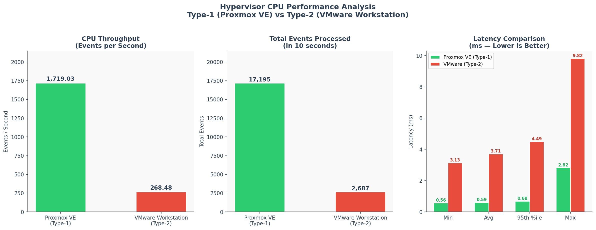

# Performance Analysis Report

**Experiment:** Type-1 vs Type-2 Hypervisor CPU Performance Comparison  
**Tool:** Sysbench 1.0.20 — `sysbench cpu --cpu-max-prime=20000 run`  
**Date:** September 21, 2026

---

## 1. Experiment Setup

Both virtual machines were configured with identical resources to ensure a fair comparison.

| Parameter | Type-1 Proxmox VE | Type-2 VMware Workstation |
| :--- | :--- | :--- |
| Hypervisor | Proxmox VE 8.3.0 (KVM) | VMware Workstation |
| Host Machine | HP Pro Tower Server (Lab) | Personal PC (Windows Host) |
| Guest OS | Ubuntu 24.04.3 LTS | Ubuntu 24.04 LTS |
| vCPU | 2 | 2 |
| RAM | 2 GB | 2 GB |
| Disk | 20 GB | 20 GB |
| Benchmark Command | `sysbench cpu --cpu-max-prime=20000 run` | `sysbench cpu --cpu-max-prime=20000 run` |

---

## 2. Raw Benchmark Results

### Type-1 Hypervisor — Proxmox VE (KVM)

```
sysbench cpu --cpu-max-prime=20000 run

CPU speed:
    events per second:   1719.03

General statistics:
    total time:          10.0012s
    total number of events: 17195

Latency (ms):
    min:     0.56
    avg:     0.59
    max:     2.82
    95th percentile: 0.68
    sum:     10012.31
```

### Type-2 Hypervisor — VMware Workstation

```
sysbench cpu --cpu-max-prime=20000 run

CPU speed:
    events per second:   268.48

General statistics:
    total time:          10.0006s
    total number of events: 2687

Latency (ms):
    min:     3.13
    avg:     3.71
    max:     9.82
    95th percentile: 4.49
    sum:     9976.42
```

---

## 3. Comparative Analysis

### 3.1 Throughput (Events per Second)

| Metric | Proxmox VE (Type-1) | VMware (Type-2) | Difference |
| :--- | :---: | :---: | :---: |
| Events per Second | 1719.03 | 268.48 | Proxmox is **6.4x faster** |
| Total Events (10s) | 17,195 | 2,687 | Proxmox processed **6.4x more events** |
| Total Time | 10.0012 s | 10.0006 s | Fixed 10s window (negligible diff) |

### 3.2 Latency

| Metric | Proxmox VE (Type-1) | VMware (Type-2) | Difference |
| :--- | :---: | :---: | :---: |
| Minimum Latency | 0.56 ms | 3.13 ms | VMware is **5.6x slower** at best case |
| Average Latency | 0.59 ms | 3.71 ms | VMware is **6.3x slower** on average |
| 95th Percentile | 0.68 ms | 4.49 ms | VMware is **6.6x less consistent** |
| Maximum Latency | 2.82 ms | 9.82 ms | VMware has **3.5x worse** worst-case spikes |

---

## 4. Performance Graph



*Figure: CPU Throughput, Total Events, and Latency comparison — Type-1 vs Type-2 Hypervisor.*

---

## 5. Analysis & Explanation

### 5.1 Why Proxmox VE (Type-1) Outperforms

**Architecture Advantage:**
- Proxmox VE runs **directly on bare-metal hardware** using KVM (Kernel-based Virtual Machine).
- Guest VM CPU instructions execute via Intel VT-x/AMD-V hardware extensions with minimal overhead.
- There is no intermediate host OS consuming CPU or memory resources.

**Dedicated Server Hardware:**
- The experiment ran on a **dedicated HP Pro Tower lab server** with no competing workloads.
- The server CPU was entirely available to the virtual machines.

### 5.2 Why VMware Workstation (Type-2) Underperforms

**Architectural Overhead:**
- VMware Workstation runs as an **application on Windows**, adding two extra abstraction layers:
  `Guest VM → VMware VMM → Windows NT Kernel → Physical CPU`
- Every privileged CPU instruction from the guest must be intercepted, translated, and re-issued through Windows.

**Host OS Resource Competition:**
- The VMware VM ran on a **personal PC running Windows** as the host OS.
- Windows background services (Defender, updates, DWM) consumed CPU cycles simultaneously.
- The Windows CPU scheduler shared processor time between Windows processes, VMware, and the Ubuntu guest VM.

**Result:** Higher latency per event (3.71ms vs 0.59ms) and far fewer total events (2,687 vs 17,195).

---

## 6. Key Observations

1. **Proxmox VE is 6.4x faster** in CPU throughput under identical benchmark conditions.
2. **Average latency is 6.3x lower** on Proxmox, meaning each task completes significantly faster.
3. **Worst-case latency spikes are 3.5x larger** on VMware, indicating poor real-time consistency.
4. The performance gap is amplified here due to two compounding factors:
   - Type-2 hypervisor architectural overhead
   - VMware running on a shared personal PC vs a dedicated lab server
5. **Total execution time (~10s) is nearly identical** for both — this is expected as sysbench runs for a fixed duration. The meaningful comparison is events processed within that window.

---

## 7. Conclusion

| Use Case | Recommended Hypervisor |
| :--- | :--- |
| Cloud Data Centers, Enterprise Servers | Type-1 (Proxmox VE / KVM / ESXi) |
| Database Servers, High-Performance Computing | Type-1 (Proxmox VE / KVM / ESXi) |
| Local Development, Testing, Labs | Type-2 (VMware Workstation / VirtualBox) |
| Desktop Sandboxing | Type-2 (VMware Workstation / VirtualBox) |

**Type-1 hypervisors are the industry standard for production workloads** because they eliminate host OS overhead, provide direct hardware access, and deliver consistent low-latency performance — as demonstrated by this experiment.

---

*Report generated as part of the Cloud Computing Lab Experiment — KLE Technological University.*
